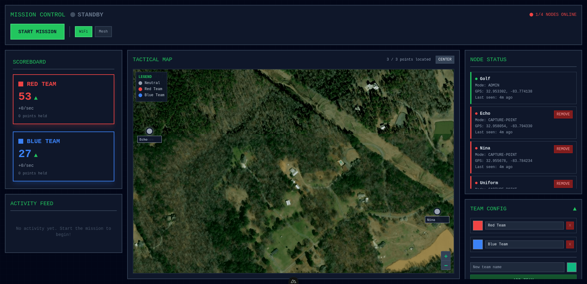

# BattleMesh

**A real-time capture point system for airsoft, paintball, and nerf games**




Turn any device into a capture point with GPS tracking, live maps, and instant score updates. Perfect for outdoor battles with multiple objectives.


## What Does It Do?

BattleMesh creates a **King of the Hill** style game:

- **Admin Control Station**: Start/stop games, view live tactical map, manage teams
- **Capture Point Devices**: Placed around the field - players tap to capture for their team
- **Live GPS Tracking**: See all capture points on a satellite map in real-time
- **Instant Scoring**: Points update immediately when captured or held

**Example Setup**: 1 admin laptop + 8 tablets placed around a field, each acting as a capture point that players fight to control.

## 🚀 Quick Start

### Step 1: Install

```bash
npm install
```

### Step 2: Try It Locally

Test with 1 admin + 3 capture points on your computer:

```bash
npm run dev:multi
```

**Then open in your browser:**
- Admin: http://localhost:3000
- Capture Points: http://localhost:3001, 3002, 3003

**Try it out:**
1. Click "Start Mission" on the admin page
2. Open one of the capture point pages
3. Click a team color to capture it
4. Watch the scores update on the admin page and capture point pages!

## How To Use

### For Your First Game

**What You Need:**
- 1 computer/laptop for the admin (game master)
- 4-8 tablets/phones for capture points (placed around field)
- All devices on the same WiFi or meshtastic network

**Setup Steps:**

1. **Build the app:**
   ```bash
   npm run build
   ```

2. **Start the admin server:**
   ```bash
   NUXT_PUBLIC_NODE_MODE=admin node .output/server/index.mjs
   ```
   
   Find your computer's IP address (e.g., `192.168.1.10`) and note the port (default: 3000)

3. **Start each capture point device:**
   ```bash
   NUXT_PUBLIC_NODE_MODE=capture-point \
   NUXT_PUBLIC_ADMIN_URL=ws://192.168.1.10:3000/api/websocket \
   node .output/server/index.mjs
   ```
   
   Replace `192.168.1.10` with your admin's IP address

4. **Play:**
   - Open the admin page on your laptop
   - Click "Start Game"
   - Place tablets around field - players tap to capture!

## Features

### For Players
- **Big Tap Buttons**: Capture for Red or Blue team with a single tap
- **Live Scores**: See current team points in real-time
- **Tactical Map**: View where other capture points are located
- **Status Display**: Shows if you're connected and GPS is working

### For Game Masters
- **Full Control**: Start, stop, and reset games from one screen
- **Live Tactical Map**: See all capture points with satellite imagery
- **Team Scores**: Real-time scoreboard with capture bonuses
- **Activity Feed**: See every capture as it happens
- **Node Monitor**: Check which devices are online

### Bonus Features
- **NATO Callsigns**: Each capture point gets a cool name (Alpha, Bravo, Charlie...)
- **GPS Tracking**: Uses external GPS hardware or your device's location
- **State Persistence**: Games survive browser refreshes and server restarts
- **Keyboard Shortcuts**: Press `S` to start/stop, `R` to reset, `C` to center map

## Configuration

### Environment Variables

Create a `.env` file:

```bash
# Required for each device
NUXT_PUBLIC_NODE_MODE=admin                    # or "capture-point"

# Required for capture points only
NUXT_PUBLIC_ADMIN_URL=ws://192.168.1.10:3000/api/websocket

# Optional
PORT=3000                                      # Server port
LOAD_PREVIOUS_STATE=true                       # Resume game after restart
```

### Game Settings

Edit `app/config/game-config.mjs`:

```javascript
// Scoring
CAPTURE_BONUS_POINTS: 10          // Points for capturing
HOLD_POINTS_PER_SECOND: 1         // Points per second for holding

// Timing
GPS_UPDATE_FREQUENCY: 1000        // GPS refresh (milliseconds)
CAPTURE_COOLDOWN: 500             // Min time between captures
```

## How Scoring Works

**Capture Bonus**: +10 points immediately when you capture a point

**Hold Points**: +1 point per second for each point your team controls

**Example**: If Red Team holds 3 capture points for 60 seconds:
- Capture bonuses: 3 × 10 = 30 points
- Hold time: 3 points/sec × 60 seconds = 180 points
- **Total: 210 points**

## Troubleshooting

### Capture Point Won't Connect

**Check these:**
- Is the admin URL correct in your `.env` file?
- Are all devices on the same WiFi network?
- Check admin IP: `ip addr` (Linux) or `ipconfig` (Windows)

### GPS Not Working

**GPS fallback**: The system automatically uses your browser's location if GPS hardware isn't detected. Just allow location permissions when prompted.

**For external GPS**: Connect USB GPS device before starting the server.

### Scores Not Updating

- Did you click "Start Game" on the admin page?
- Check if capture points show "Connected" status
- Check the admin logs

### Map Tiles Not Loading

- **First load**: Requires internet to download map tiles
- **After that**: Tiles are cached, works offline
- **Fix**: Allow location permissions and refresh the page

## Important Files

```
.battlemesh-state.json       # Game state (scores, captures, teams)
.battlemesh-node-3000        # Admin server's NATO name
.battlemesh-node-3001        # Capture point NATO names (one per device)
```

**To reset everything:**
```bash
rm .battlemesh-state.json .battlemesh-node-*
```
OR alternatively, go to the admin ui and select "CLEAR ALL STATE" in the team config.

## Advanced Topics

<details>
<summary><b>Network Modes</b></summary>

**WiFi Mode (Default)**:
- Devices connect via WebSocket
- Requires WiFi network
- Best for most setups

**Meshtastic Mode**:
- Uses Bluetooth mesh radios
- Works without WiFi
- Requires Meshtastic devices paired to each server
- Enable in admin UI: Network Mode → Meshtastic

</details>

<details>
<summary><b>Hardware Recommendations</b></summary>

**Admin Server:**
- Laptop or desktop
- 2+ CPU cores, 2GB RAM
- 1920×1080 display recommended
- Ethernet or stable WiFi

**Capture Points (×8 recommended):**
- Old tablets/phones work great
- Touchscreen recommended
- 1280×720 or better
- WiFi required (Bluetooth for Meshtastic)

</details>

<details>
<summary><b>State Persistence</b></summary>

**What gets saved:**
- Team scores and capture point ownership
- Connected nodes and their locations
- Activity feed (all captures)
- Game status (running/stopped)

**When it saves:**
- Automatically after every capture
- When teams are added/removed
- When game starts/stops
- Captures saved immediately (no delay)

**Browser refresh**: Always loads current game state  
**Server restart**: Loads previous game if `LOAD_PREVIOUS_STATE=true`

</details>

<details>
<summary><b>Running Tests</b></summary>

```bash
npm test              # Run all tests
npm run test:coverage # See test coverage
npm run lint          # Check code style
```

</details>

<details>
<summary><b>Technical Stack</b></summary>

- **Nuxt 4** - Full-stack Vue.js framework
- **Pinia** - State management
- **Tailwind CSS** - Styling
- **Leaflet.js** - Maps with Esri satellite imagery
- **WebSockets** - Real-time communication
- **Web APIs** - GPS, Bluetooth, Geolocation

</details>


## Contributing

Found a bug or want to add a feature?

1. Fork the repo
2. Create a branch: `git checkout -b my-feature`
3. Make your changes
4. Run tests: `npm test`
5. Submit a pull request!


## License

MIT License - feel free to use for your own games!


## Tips for Best Results

- **Pre-cache map tiles**: Zoom around your field area before starting
- **Test first**: Do a practice run before game day
- **Charge everything**: Make sure all devices are fully charged
- **Static IPs**: Set static IPs on all devices to avoid connection issues
- **Check GPS**: Test GPS before placing devices in the field

